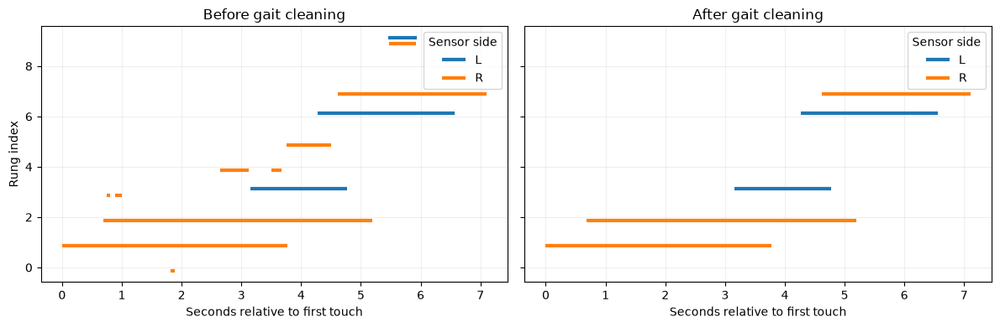
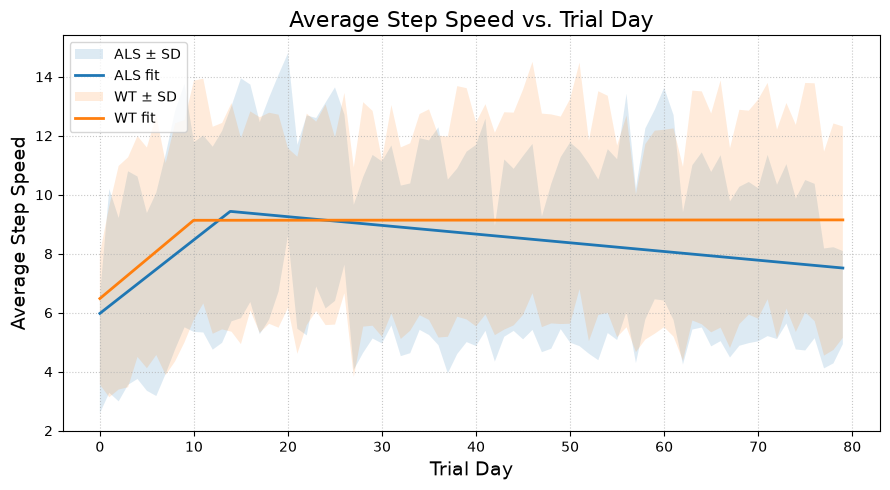

# Hengen Lab ALS vs. WT Gait Analysis

I analyzed ladder-task crossings from four mice to explore how gait changed over trial time in ALS and wild-type (WT) groups. The [executed notebook](Hengen-Lab-ALS-WT-Analysis.ipynb) follows my analysis chronologically, from loading and cleaning rung touches through calculating gait measurements and plotting ALS/WT trends. It contains the saved outputs, so the figures can be viewed without rerunning the code.

## Process

The four `all_crosses_*.pkl` files contain processed crossings from two ALS mice (`RCC00023`, `RCC00028`) and two WT mice (`RCC00024`, `RCC00027`). For each crossing, I:

1. Cleaned the already unmixed rung-touch intervals, removing touches lasting 80 ms or less, merging successive intervals on the same rung, and applying a touch-order and behavior filter.
2. Calculated ten gait measurements, including step speed, stance and stride durations, duty factor, total steps, and gait adjustments. I assigned trial days relative to a 07:00 boundary.
3. Applied a 1.5×IQR outlier rule to the ten measurements and applied the outlier rule to trial-day and day/night groups, pooling the mice represented in each group to remove circadian influence.
4. Compared ALS and WT crossings before trial day 80 (~P170) by fitting a separate two-segment piecewise-linear trend to each genotype and plotting the fitted lines alongside shaded daily mean ± standard deviation bands.
## Figures

### Cleaning

This example shows one crossing before cleaning and after cleaning.

### Results

Step speed was the measurement I found most useful for visualizing possible ALS motor decline. In this descriptive fit, the ALS line trends downward after its early increase, while the WT line is nearly level over later trial days.

